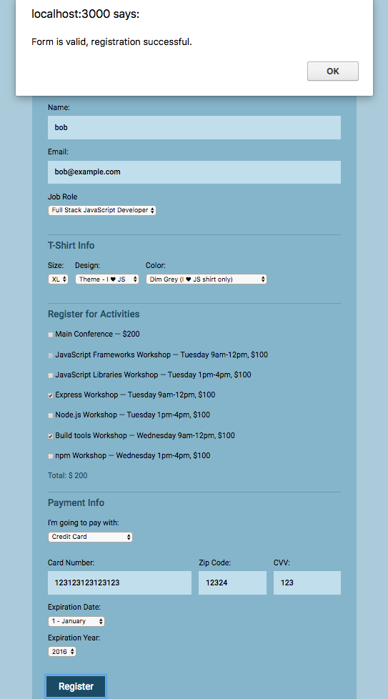
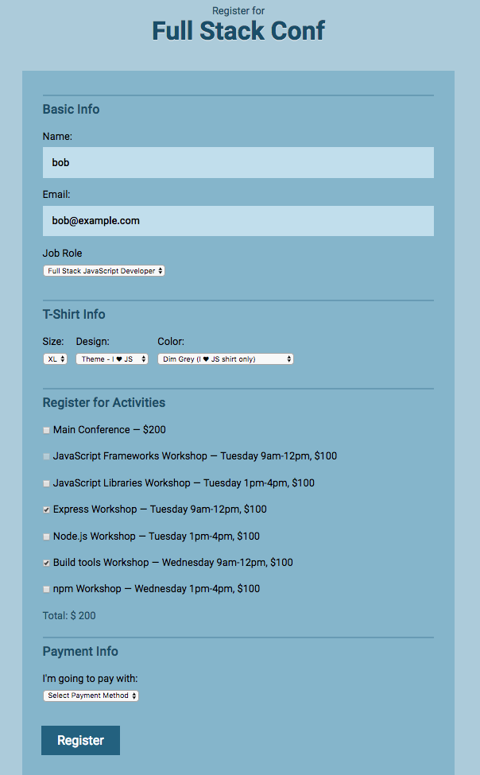

# Build an interactive form

## Introduction

In this project, a HTML Form and its styling was given to me (as can be seen in `initial_assets` folder, and I have to add interactivity to it according to project instructions (including form validity checking functionality) using JavaScript.

## Usage

### Demo pages

You can see the demo page [here](https://wahidyankf.github.io/build-an-interactive-form/).

### Result

The result can be seen in the gh-pages branch of this repository.

### The Source

The source of this app can be seen in the src folder of master branch. 

## Testing

This app was tested using [HTML](https://validator.w3.org/) and [CSS](https://jigsaw.w3.org/css-validator/) validator.

## Sreenshots

## License

[MIT](https://en.wikipedia.org/wiki/MIT_License).